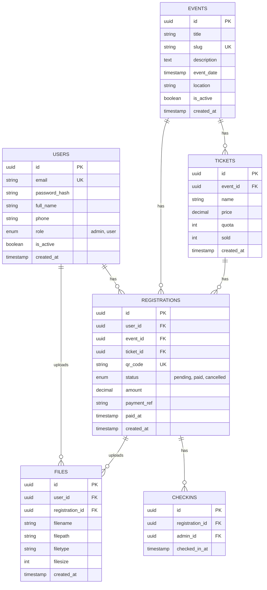

# System Architecture

## High-Level Architecture

```
┌─────────────────────────────────────────────────────────────┐
│                        CLIENTS                              │
├─────────────────────────────────────────────────────────────┤
│  ┌─────────────────┐  ┌─────────────────┐                   │
│  │  Public Website │  │  Admin Dashboard │                  │
│  │  (Nuxt 4 SSR)   │  │   (Nuxt 4 PWA)   │                  │
│  └────────┬────────┘  └────────┬─────────┘                  │
└───────────┼────────────────────┼────────────────────────────┘
            │                    │
            └──────────┬─────────┘
                       ▼
┌─────────────────────────────────────────────────────────────┐
│                      NGINX (Reverse Proxy)                  │
└─────────────────────────────────────────────────────────────┘
                       │
        ┌──────────────┴──────────────┐
        ▼                             ▼
┌───────────────────┐       ┌───────────────────┐
│   Nuxt Server     │       │   FastAPI         │
│   (SSR/Static)    │       │   (REST API)      │
└───────────────────┘       └─────────┬─────────┘
                                      │
        ┌─────────────────────────────┼─────────────────┐
        ▼                             ▼                 ▼
┌───────────────┐           ┌───────────────┐   ┌─────────────┐
│  PostgreSQL   │           │ Midtrans/     │   │    SMTP     │
│   Database    │           │ Xendit        │   │   Email     │
└───────────────┘           └───────────────┘   └─────────────┘
```

---

## Component Details

### Frontend (Nuxt 4)

```
frontend/
├── app/
│   ├── pages/
│   │   ├── index.vue              # Landing page
│   │   ├── events/
│   │   │   ├── index.vue          # Event listing
│   │   │   └── [slug].vue         # Event detail + register
│   │   ├── checkout.vue           # Checkout page
│   │   ├── payment/
│   │   │   ├── pending.vue        # Waiting payment
│   │   │   └── success.vue        # Payment success
│   │   ├── auth/
│   │   │   └── login.vue          # User login
│   │   ├── dashboard/             # User dashboard
│   │   │   ├── index.vue          # My registrations
│   │   │   └── files.vue          # Upload files
│   │   └── admin/                 # Admin dashboard (PWA)
│   │       ├── index.vue          # Overview
│   │       ├── events/            # Event management
│   │       ├── users/             # User management
│   │       ├── files/             # File management
│   │       └── scan.vue           # QR Scanner
│   ├── components/
│   │   ├── QRScanner.vue          # Camera QR scanner
│   │   ├── QRDisplay.vue          # Show QR code
│   │   └── FileUpload.vue         # File upload component
│   ├── composables/
│   │   ├── useAuth.ts
│   │   ├── useQRScanner.ts
│   │   └── usePayment.ts
│   └── stores/
│       ├── auth.ts
│       └── event.ts
├── nuxt.config.ts                 # PWA config here
└── package.json
```

### Backend (FastAPI)

```
backend/
├── app/
│   ├── main.py                    # FastAPI entry
│   ├── config.py                  # Settings
│   ├── api/
│   │   ├── v1/
│   │   │   ├── auth.py            # Login, register
│   │   │   ├── events.py          # Event CRUD
│   │   │   ├── registrations.py   # Registration
│   │   │   ├── payments.py        # Payment + webhook
│   │   │   ├── checkins.py        # QR check-in
│   │   │   ├── files.py           # File upload/download
│   │   │   └── users.py           # User management
│   │   └── deps.py                # Dependencies
│   ├── models/                    # SQLAlchemy models
│   ├── schemas/                   # Pydantic schemas
│   ├── services/
│   │   ├── payment_service.py     # Midtrans/Xendit
│   │   ├── email_service.py       # Send emails
│   │   └── qr_service.py          # QR generation
│   └── utils/
├── alembic/                       # Migrations
└── requirements.txt
```

---

## Database Schema



---

## Infrastructure

### VPS Setup (Biznet)

```yaml
Server:
  CPU: 2-4 vCPU
  RAM: 4-8 GB
  Storage: 50-100 GB SSD
  OS: Ubuntu 22.04 LTS

Services:
  - Nginx (reverse proxy + SSL)
  - Docker (containerization)
  - PostgreSQL 15
  - Let's Encrypt (SSL)
```

### Docker Compose

```yaml
version: '3.8'
services:
  nginx:
    image: nginx:alpine
    ports: ["80:80", "443:443"]
    volumes:
      - ./nginx:/etc/nginx/conf.d
      - ./certbot:/etc/letsencrypt
    depends_on: [api, frontend]

  frontend:
    build: ./frontend
    environment:
      - NUXT_PUBLIC_API_URL=https://api.eventhub.id

  api:
    build: ./backend
    environment:
      - DATABASE_URL=postgresql://user:pass@db/eventhub
    depends_on: [db]

  db:
    image: postgres:15-alpine
    volumes:
      - pgdata:/var/lib/postgresql/data
    environment:
      - POSTGRES_DB=eventhub

volumes:
  pgdata:
```

---

## Security

| Layer | Implementation |
|-------|----------------|
| **Auth** | JWT with refresh tokens |
| **Password** | bcrypt hashing |
| **Transport** | HTTPS only (Let's Encrypt) |
| **Input** | Pydantic validation |
| **SQL** | SQLAlchemy ORM (no raw queries) |
| **Files** | Type validation, size limits |
| **QR** | Signed with HMAC |
