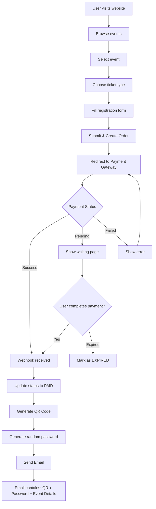
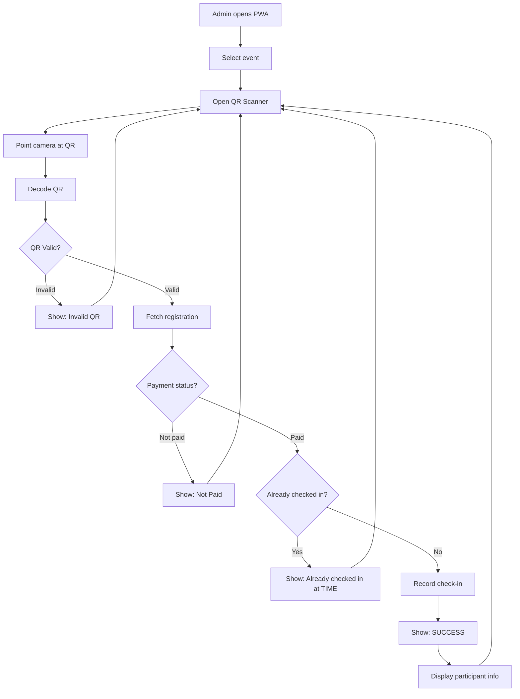
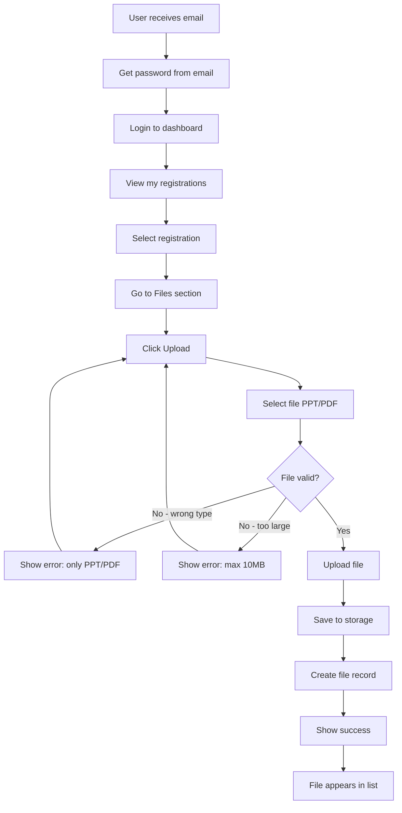
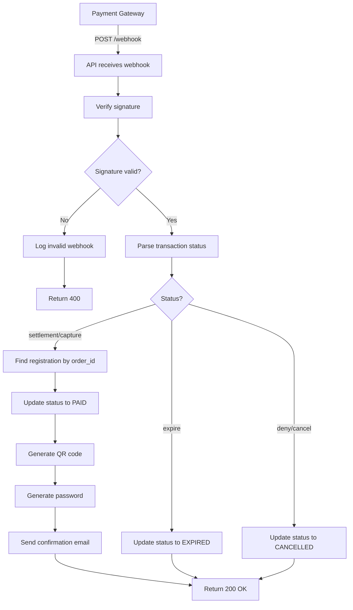
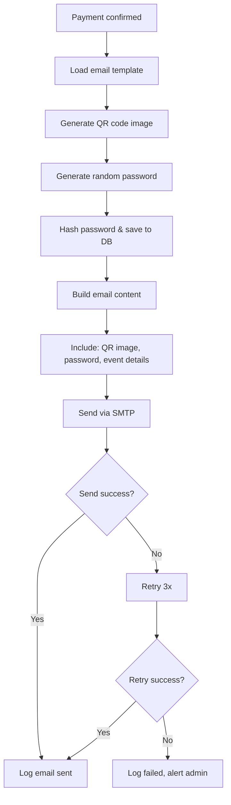
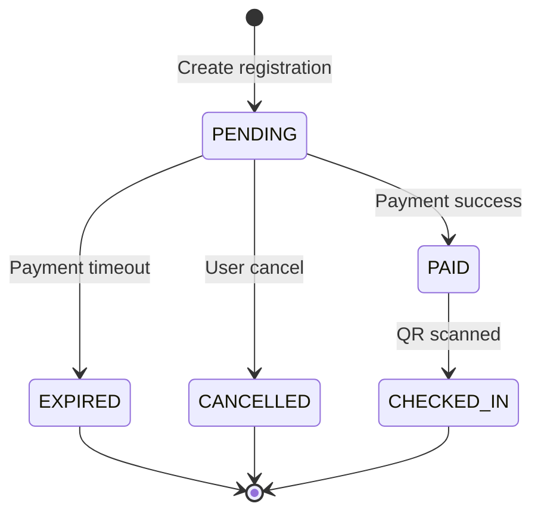
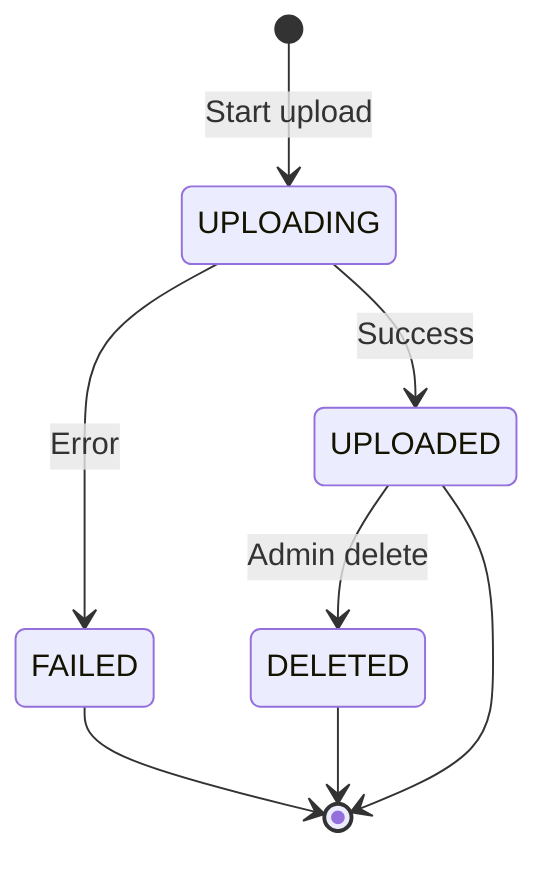

# Flowcharts

## 1. Registration & Payment Flow



---

## 2. Check-in Flow (Admin Scan)



---

## 3. User File Upload Flow



---

## 4. Admin File Management Flow

```mermaid
flowchart TD
    A[Admin opens dashboard] --> B[Go to Files]
    B --> C[Filter by event]
    C --> D[View file list]
    D --> E{Action?}
    
    E -->|View| F[Preview/Download file]
    F --> D
    
    E -->|Delete| G[Confirm delete]
    G --> H{Confirmed?}
    H -->|Yes| I[Delete file]
    I --> D
    H -->|No| D
    
    E -->|Upload material| J[Select file]
    J --> K[Mark as "material"]
    K --> L[Upload]
    L --> D
```

---

## 5. Payment Webhook Flow



---

## 6. Email Generation Flow



---

## 7. State Diagrams

### Registration Status



### File Status


